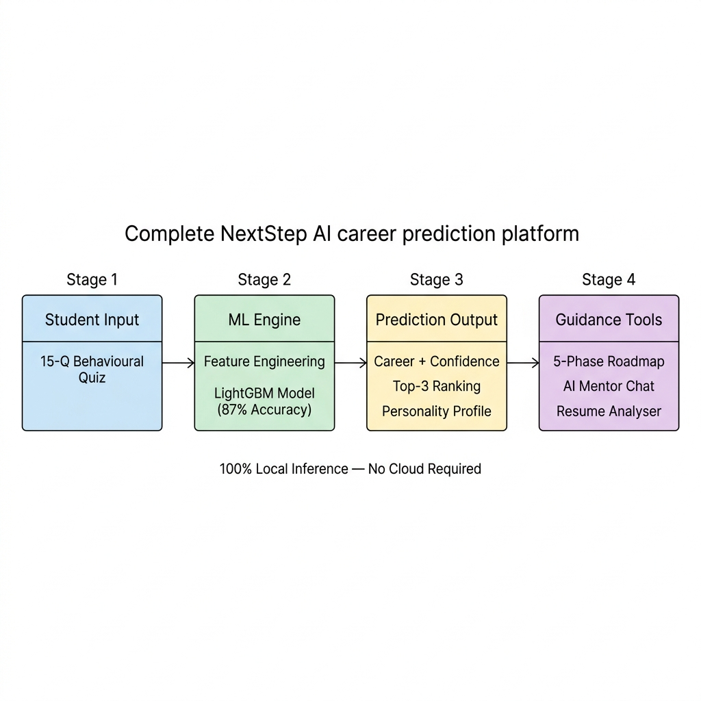
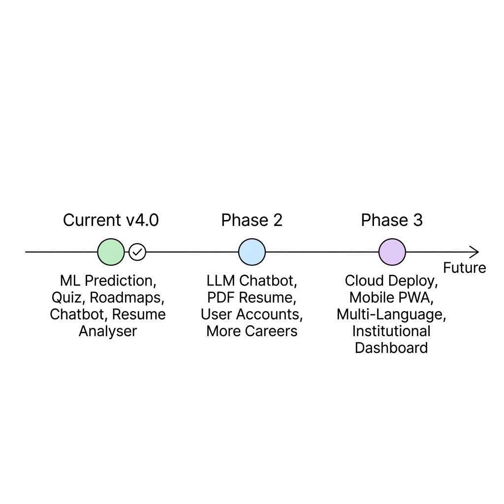

# Conclusion

## NextStep AI — Intelligent Career Prediction System

---

## 1. Project Summary

NextStep AI is an ML-powered career prediction platform that guides students toward suitable career paths based on their academic profile, personality traits, skills, and interests. The system transforms a 15-question behavioural quiz into a 23-feature vector and classifies users into one of five career categories using a trained LightGBM model.

### System Overview

The platform provides an end-to-end career guidance experience:

| Component | Function |
|---|---|
| **Neural Assessment** | 15-question behavioural quiz capturing student profile |
| **ML Prediction Engine** | LightGBM classifier with 87% accuracy and 0.93 AUC |
| **Results Dashboard** | Career prediction, confidence score, top-3 ranking, personality profile |
| **Career Roadmap** | 5-phase learning path tailored to the predicted career |
| **AI Mentor Chatbot** | Rule-based career guidance across 10 intent categories |
| **Resume Analyser** | ATS-style scoring (0–100) with keyword matching and structural analysis |

---

## 2. Key Achievements

### 2.1 Model Performance

The comparative study of **10 model configurations** across 2 algorithms, 3 feature selection techniques, and Bayesian hyperparameter tuning yielded the following results:

| Achievement | Detail |
|---|---|
| **Best Model** | M4: LightGBM + All Features + Optuna Tuning |
| **Accuracy** | 87% on held-out test set |
| **AUC Score** | 0.93 (Macro OVO) — strong class discrimination |
| **Tuning Gain** | +3–5% improvement via Optuna over baseline models |
| **Feature Reduction** | 32% fewer features (22 → 15) with only 1–2% accuracy loss |

### 2.2 Technical Achievements

| Achievement | Detail |
|---|---|
| **Privacy-First Design** | 100% local inference — no data transmitted externally |
| **Dual Frontend** | Streamlit (rich UI) + Flask (lightweight API) |
| **Graceful Degradation** | Demo mode operates without model files |
| **Comprehensive UI** | Neon glassmorphism design with animations and responsive layout |
| **Rigorous Evaluation** | 10% noise injection + SMOTE + 5-metric evaluation framework |

### 2.3 Key Findings from Comparative Analysis

1. **LightGBM outperforms Decision Tree** by ~7% accuracy on average, confirming the advantage of ensemble gradient boosting.
2. **SHAP and Boruta** are the most effective feature selectors, both achieving comparable results while reducing model complexity.
3. **Skills and interest features** (coding_skill, tech_interest, art_interest) are the strongest predictors of career suitability.
4. **Personality traits** (Big Five) contribute moderately, providing complementary signal to skill-based features.
5. **SMOTE** is essential for fair performance across all career categories, especially minority classes (Software Developer: 5.7%, Data Scientist: 4.5%).

---

## 3. Objectives Achieved

| # | Objective | Status |
|---|---|---|
| 1 | Build a multi-class career prediction model | ✅ Achieved — LightGBM with 87% accuracy |
| 2 | Compare Decision Tree and LightGBM classifiers | ✅ Achieved — 10 configurations benchmarked |
| 3 | Evaluate SHAP, MI, and Boruta feature selection | ✅ Achieved — SHAP and Boruta identified as best |
| 4 | Apply Optuna for hyperparameter tuning | ✅ Achieved — 40-trial Bayesian optimisation per model |
| 5 | Handle class imbalance using SMOTE | ✅ Achieved — balanced training via synthetic oversampling |
| 6 | Deploy in an interactive web application | ✅ Achieved — Streamlit app with 5 pages + Flask API |

---

## 4. Limitations

| Limitation | Description |
|---|---|
| **Synthetic Labels** | Career labels are rule-based, not from real career outcomes |
| **Small Dataset** | 1,000 samples from merged sources; may not capture full diversity |
| **Limited Careers** | Only 5 career categories in the current model |
| **Rule-Based Chatbot** | AI Mentor uses keyword matching, not natural language understanding |
| **No User Persistence** | Predictions are session-based; no login or history tracking |

---

## 5. Future Scope

### Development Roadmap

### Phase 2 — Planned Enhancements

| Enhancement | Description |
|---|---|
| **LLM-Powered Chatbot** | Replace rule-based chatbot with local LLM (Ollama/Llama) for freeform mentoring |
| **PDF Resume Parsing** | Accept uploaded PDF resumes via PyMuPDF or pdfplumber |
| **User Accounts** | Firebase/SQLite for saving predictions and tracking progress across sessions |
| **Real Career Data** | Replace synthetic labels with survey-collected ground truth outcomes |
| **Extended Careers** | Expand from 5 to 15+ career categories (Cloud Engineer, DevOps, Mobile Dev, etc.) |
| **Skill Gap Analysis** | Compare user profile against industry benchmarks to identify growth areas |

### Phase 3 — Future Vision

| Enhancement | Description |
|---|---|
| **Cloud Deployment** | Deploy to Streamlit Cloud / Hugging Face Spaces / Railway for public access |
| **Mobile PWA** | Progressive Web App for mobile-first, installable experience |
| **Multi-Language Support** | Hindi and regional Indian language interfaces |
| **Institutional Dashboard** | Analytics console for career counsellors managing student cohorts |
| **Neural Feature Mapping** | Replace hand-crafted quiz-to-feature engineering with a learned embedding network |

---

## 6. Final Remarks

NextStep AI successfully demonstrates that machine learning can provide accessible, privacy-preserving career guidance to students. The rigorous 10-model comparative analysis validates LightGBM as the optimal classifier, while SHAP-based feature analysis provides transparency into the prediction process. The Streamlit-based interface makes the system immediately usable without installation complexity, and the modular architecture supports future expansion into LLM-powered mentoring, cloud deployment, and institutional analytics.

The project establishes a solid foundation for AI-driven career counselling that can scale to serve students across institutions, languages, and career domains.
