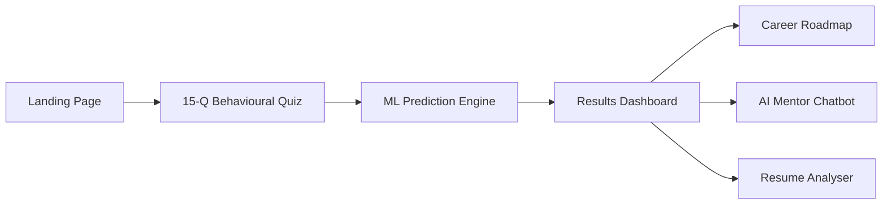
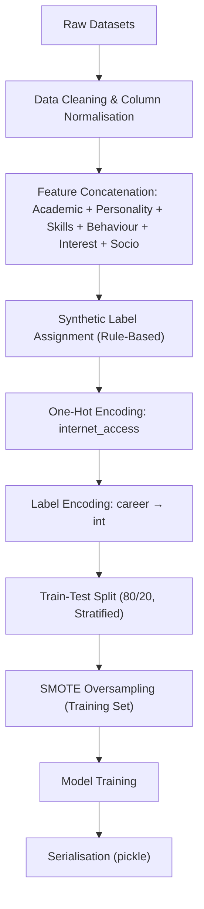
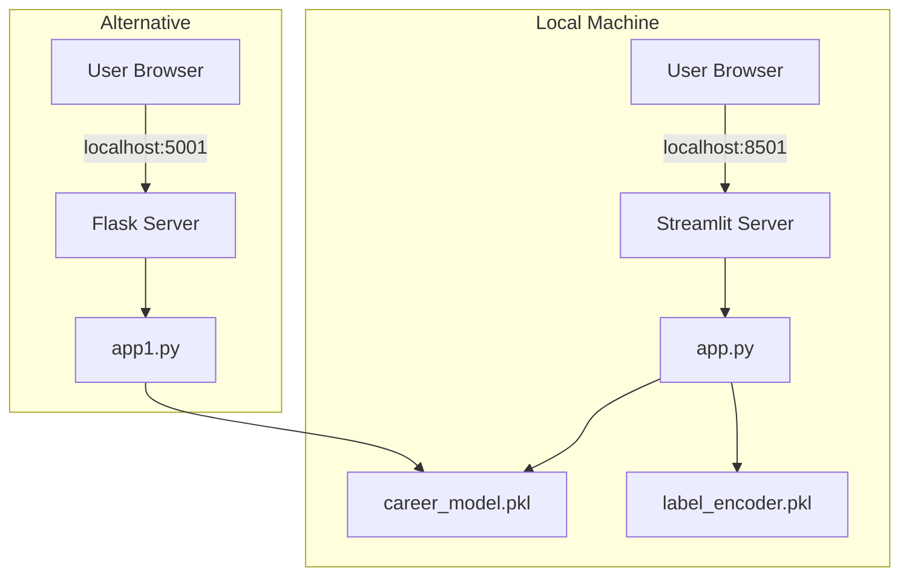

# Product Requirements Document (PRD)

## NextStep AI — Intelligent Career Prediction System

| Field | Value |
|---|---|
| **Product Name** | NextStep AI |
| **Tagline** | Your Smart Career Guide to the Next Step |
| **Author** | Sneha Chandel |
| **Version** | 4.0 |
| **Last Updated** | 2026-05-08 |
| **Status** | Active Development |

---

## 1. Executive Summary

**NextStep AI** is an intelligent, ML-powered career prediction platform that helps students and early-career professionals discover their optimal career path. By combining a 15-question behavioural assessment with a trained classification model, the system maps a user's personality traits, academic profile, skills, and interests to one of several career categories—delivering a personalised prediction with confidence scoring, a phase-by-phase career roadmap, an AI mentor chatbot, and a resume analyser.

The product runs entirely on **local inference** (no external API keys required), is built with **Streamlit** for the front-end, and uses a **scikit-learn / LightGBM** model pipeline serialised as `career_model.pkl`.

---

## 2. Problem Statement

### 2.1 The Problem

Students and fresh graduates face overwhelming career choice paralysis. They lack:

- **Self-awareness**: No structured way to map their personality, skills, and interests to viable careers.
- **Actionable guidance**: Generic career advice does not account for individual profiles.
- **Accessible tools**: Most career counselling is expensive, appointment-based, and unavailable at scale.

### 2.2 The Opportunity

An AI-driven system that processes a short behavioural quiz and instantly returns a personalised, data-backed career recommendation—along with a learning roadmap, mentorship chat, and resume feedback—can democratise career guidance at zero marginal cost per user.

---

## 3. Target Users

| Persona | Description |
|---|---|
| **College Students** | Undergraduate students (years 1–4) exploring career directions before committing to a specialisation. |
| **Fresh Graduates** | Recent B.Tech / B.Sc / BCA graduates deciding between job roles, higher studies, or entrepreneurship. |
| **Career Switchers** | Early-career professionals (0–3 years) considering a pivot into a different domain. |
| **Career Counsellors** | Educators and mentors who want a data-driven tool to guide their students. |

---

## 4. Product Goals & Success Metrics

### 4.1 Goals

1. **Accurate Prediction** — Deliver career predictions with ≥ 80% alignment to user expectations (validated via feedback).
2. **Engagement** — Achieve a 70%+ quiz completion rate once users start the assessment.
3. **Actionable Output** — Every prediction includes a 5-phase roadmap, mentor guidance, and resume feedback.
4. **Privacy-First** — All inference runs locally; no data leaves the user's machine.

### 4.2 Key Metrics

| Metric | Target | Measurement |
|---|---|---|
| Quiz Completion Rate | ≥ 70% | Sessions starting quiz → reaching results |
| Prediction Confidence (avg) | ≥ 65% | Average top-1 probability from `predict_proba` |
| Model Accuracy (test set) | ≥ 85% | Accuracy score on held-out 20% test split |
| Model AUC (macro, test set) | ≥ 0.90 | OVO macro AUC on held-out test split |
| Resume Analyser Usage | ≥ 30% of result viewers | Users who paste a resume after seeing results |
| Chatbot Interaction Depth | ≥ 3 messages/session | Avg. messages sent per chat session |

---

## 5. Feature Specification

### 5.1 Feature Overview



---

### 5.2 F1 — Landing / Home Page

| Attribute | Detail |
|---|---|
| **Priority** | P0 (Core) |
| **Description** | A visually immersive hero section introducing NextStep AI with feature pills and a CTA to start the assessment. |
| **Key Elements** | Animated gradient background, floating hero with eyebrow badge, 6 feature cards (AI Prediction, Personality Map, Roadmap Generator, Mentor Chatbot, Resume Analyzer, Top 3 Matches). |
| **CTA** | "🚀 Start Neural Assessment" → navigates to quiz. |

---

### 5.3 F2 — Neural Assessment (15-Question Behavioural Quiz)

| Attribute | Detail |
|---|---|
| **Priority** | P0 (Core) |
| **Description** | A guided, one-question-at-a-time quiz that captures the user's cognitive and behavioural profile. |
| **Questions** | 15 MCQs covering: problem-solving approach, weekend activities, group roles, math comfort, academic subject preference, public speaking, pressure response, work environment, academic performance, self-learning habits, hackathon experience, product building preference, communication style, career motivation, 5-year vision. |
| **Navigation** | Forward on answer selection, back button for correction. Animated progress bar with step badge. |
| **Output** | A list of 15 integer answer indices (`[0–3]` per question), stored in `st.session_state.answers`. |

#### Quiz → Feature Vector Mapping

The 15 quiz answers are transformed into a **22-feature numeric vector** (+ one-hot encoded `internet_access`) through a hand-crafted feature engineering pipeline:

| Feature Category | Features | Derivation |
|---|---|---|
| **Academic** | `grade1`, `grade2`, `final_grade`, `study_time`, `failures`, `absences` | Mapped from academic performance and self-learning questions with clamping. |
| **Personality (Big Five)** | `openness`, `conscientiousness`, `extraversion`, `agreeableness`, `neuroticism` | Composite scores from multiple quiz answers, normalised to `[0, 1]`. |
| **Skills** | `coding_skill`, `communication_skill`, `analytical_skill` | Derived from tech/art/research latent signals + individual question answers. Calibrated with dominant-intent boosting. |
| **Behaviour** | `study_hours`, `consistency`, `participation` | Mapped from self-learning and deadline-control question answers. |
| **Interest** | `tech_interest`, `art_interest`, `business_interest` | Latent signal scores (0–9) from 5 career-domain-specific questions. |
| **Socioeconomic** | `family_income`, `internet_access` | Inferred from quiz context; `internet_access` one-hot encoded. |

> [!IMPORTANT]
> The quiz-to-feature mapping includes a **dominant-intent calibration** step that boosts the strongest domain signal above model decision boundaries, ensuring differentiated predictions across distinct quiz profiles.

---

### 5.4 F3 — ML Prediction Engine

| Attribute | Detail |
|---|---|
| **Priority** | P0 (Core) |
| **Model File** | `career_model.pkl` (≈2.3 MB, serialised via `pickle`) |
| **Label Encoder** | `label_encoder.pkl` (maps numeric class IDs back to career strings) |
| **Inference** | `model.predict(feature_vector)` for top career; `model.predict_proba(feature_vector)` for confidence + top-3 ranking. |
| **Fallback** | Demo mode with hardcoded predictions if `.pkl` files are missing. |

#### 5.4.1 Career Categories

The model classifies users into one of the following career categories:

| # | Career | Icon |
|---|---|---|
| 1 | Software Developer | 💻 |
| 2 | Data Scientist | 📊 |
| 3 | Machine Learning Engineer | 🤖 |
| 4 | Web Developer | 🌐 |
| 5 | UX Designer | 🎨 |
| 6 | Product Manager | 🎯 |
| 7 | Data Analyst | 📈 |
| 8 | Cybersecurity Analyst | 🔐 |
| 9 | Research Scientist | 📚 |
| 10 | Entrepreneur | 🚀 |

*(Core training labels: Software Developer, Data Scientist, UI/UX Designer, Entrepreneur, Research Scientist. Extended labels supported via label encoder.)*

#### 5.4.2 Model Training Pipeline

The training pipeline (documented in `model.ipynb`) follows this architecture:



**Data Sources:**

| Dataset | Records | Purpose |
|---|---|---|
| `student_data.csv` | ~400 | Academic grades, study time, absences (UCI Student Performance) |
| `data-final.csv` | ~416 MB | Personality traits (Big Five) |
| `skills.csv` | ~1 MB | Coding, communication, analytical skills |
| `Student Attitude and Behavior.csv` | ~29 KB | Study hours, consistency, participation |
| `final_career_dataset.csv` | ~187 KB | Merged & labelled training dataset (1,000 rows, 23 features) |

#### 5.4.3 Comparative Model Analysis (10-Model Benchmark)

A rigorous comparative analysis (`generate_comparative_analysis.py`) benchmarks **10 model configurations** across 5 metrics:

| Model | Algorithm | Feature Selection | Tuning |
|---|---|---|---|
| M1 | Decision Tree | All features | Baseline |
| M2 | LightGBM | All features | Baseline |
| M3 | Decision Tree | All features | Optuna (40 trials) |
| M4 | LightGBM | All features | Optuna (40 trials) |
| M5 | LightGBM | SHAP top-15 | Optuna (40 trials) |
| M6 | Decision Tree | SHAP top-15 | Optuna (40 trials) |
| M7 | LightGBM | Mutual Information top-15 | Optuna (40 trials) |
| M8 | LightGBM | Boruta-selected | Optuna (40 trials) |
| M9 | Decision Tree | Mutual Information top-15 | Optuna (40 trials) |
| M10 | Decision Tree | Boruta-selected | Optuna (40 trials) |

**Evaluation Metrics:** Accuracy, Precision (macro), Recall (macro), F1 (macro), AUC (macro OVO).

**Techniques Used:**
- **SMOTE** for class imbalance handling
- **SHAP** (TreeExplainer) for feature importance
- **Mutual Information** (SelectKBest) for feature selection
- **Boruta** (RandomForest-based) for feature selection
- **Optuna** for Bayesian hyperparameter optimisation
- **10% label noise injection** for realistic evaluation

---

### 5.5 F4 — Results Dashboard

| Attribute | Detail |
|---|---|
| **Priority** | P0 (Core) |
| **Components** | Primary result card (career + icon + confidence + explanation), SVG confidence ring, personality chips, top-3 ranked matches with animated bars, career roadmap, action buttons. |

#### 5.5.1 Personality Profiling

Derived from quiz answers, the system tags users with personality descriptors:

| Tag | Condition | CSS Class |
|---|---|---|
| Introvert | Prefers deep-focus / avoids speaking | `pc-in` |
| Extrovert | Enjoys speaking / coordination | `pc-ex` |
| Analytical | Logical approach + math comfort | `pc-an` |
| Creative | Brainstorming + design preference | `pc-cr` |
| Leader | Coordinator role + loves presenting | `pc-ld` |
| Researcher | Logical + reading/research + discovery | `pc-an` |
| Explorer | Fallback if no strong signal | `pc-an` |

#### 5.5.2 Personalised Explanation

A natural-language sentence is generated from quiz answers highlighting the user's top 2 strengths (e.g., "Your sharp logical reasoning and self-driven curiosity position you well for a career in Data Scientist").

---

### 5.6 F5 — Career Roadmap Generator

| Attribute | Detail |
|---|---|
| **Priority** | P0 (Core) |
| **Description** | A 5-phase, vertical-timeline career roadmap tailored to the predicted career. |
| **Coverage** | 9 career-specific roadmaps + 1 default fallback. |

Each phase includes:
- **Tag** (e.g., "Phase 01 · Foundations")
- **Title** (e.g., "Programming Fundamentals")
- **Description** (1–2 sentence actionable guidance)
- **Skills** (3–4 skill tags with colour-coded badges)

**Supported Career Roadmaps:**
Software Developer, Data Scientist, Machine Learning Engineer, Web Developer, UX Designer, Product Manager, Data Analyst, Cybersecurity Analyst, Default.

---

### 5.7 F6 — AI Mentor Chatbot

| Attribute | Detail |
|---|---|
| **Priority** | P1 (Important) |
| **Type** | Rule-based, keyword-intent chatbot (no LLM / no API keys). |
| **Personalisation** | Responses are calibrated to the user's predicted career. |

#### Intent Detection

| Intent | Trigger Keywords |
|---|---|
| `skills` | skill, learn, language, tool, technology |
| `start` | start, begin, roadmap, first step |
| `next` | next, advanced, improve, level up |
| `projects` | project, portfolio, build, create |
| `interview` | interview, prepare, crack, job |
| `salary` | salary, pay, earn, package, CTC |
| `internship` | intern, experience, fresher |
| `resume` | resume, CV, ATS |
| `certifications` | cert, course, Udemy, Coursera |
| `college` | college, degree, tier, IIT, NIT |

**Knowledge Base:** Career-specific responses for 9 careers + general fallback. Each career has 5 topic areas (skills, start, next, projects, interview). General KB covers salary, internship, resume, certifications, college.

**UI:** Chat bubble interface with suggested prompt buttons, conversation history, and clear functionality.

---

### 5.8 F7 — Resume Analyser

| Attribute | Detail |
|---|---|
| **Priority** | P1 (Important) |
| **Input** | Plain-text resume (pasted into a text area). |
| **Output** | Score (0–100), Grade (A/B/C/D), matched keywords, missing keywords, improvement suggestions. |

#### Scoring Algorithm

| Component | Max Points | Method |
|---|---|---|
| Keyword Match | 49 | `(matched / total_keywords) × 49` against career-specific keyword list |
| GitHub Link | 9 | Presence of "github" |
| Quantified Impact | 11 | Regex for `%`, `x`, `$`, `₹`, user/client counts |
| Action Verbs | 8 | Presence of "built", "developed", "deployed", etc. |
| Education | 5 | Presence of degree terms (B.Tech, BSc, CGPA, etc.) |
| Contact Info | 4 | Presence of email, phone, LinkedIn |
| Length Check | 14 (good) / 3 (bad) | 180–750 words optimal |

**Career-Specific Keywords:** 9 career-specific keyword lists + 1 default. Example: Software Developer checks for Python, JavaScript, React, Node, API, SQL, Docker, Git, testing, CI/CD, agile, TypeScript.

---

## 6. Technical Architecture

### 6.1 Technology Stack

| Layer | Technology |
|---|---|
| **Frontend** | Streamlit 1.55 with custom CSS (glassmorphism design system) |
| **Alternative Frontend** | Flask + Jinja2 HTML template (`app1.py` + `templates/index.html`) |
| **ML Framework** | scikit-learn 1.7, LightGBM, SHAP, Optuna |
| **Data Processing** | Pandas, NumPy |
| **Class Balancing** | imbalanced-learn (SMOTE) |
| **Feature Selection** | SHAP TreeExplainer, Mutual Information, Boruta |
| **Serialisation** | Python pickle (`career_model.pkl`, `label_encoder.pkl`, `features.pkl`) |
| **Visualisation** | Matplotlib, Seaborn, WordCloud |
| **Runtime** | Python 3.x with virtual environment (`.venv`) |

### 6.2 File Structure

```
Practicum/
├── app.py                          # Main Streamlit application (1,630 lines)
├── app1.py                         # Flask-based prediction API (88 lines)
├── model.ipynb                     # Jupyter notebook: data merging, training, evaluation
├── career_model.pkl                # Serialised ML model (2.3 MB)
├── label_encoder.pkl               # Label encoder for career classes
├── features.pkl                    # Stored feature names
├── final_career_dataset.csv        # Merged training dataset (1,000 rows)
├── generate_comparative_analysis.py # 10-model benchmark script
├── train_lgbm_optuna.py            # SHAP + Optuna + LightGBM training pipeline
├── train_decision_tree.py          # Decision Tree baseline training
├── model_1_dt_baseline.py          # Individual model scripts (M1–M10)
├── model_2_lgbm_baseline.py
├── ...
├── model_10_boruta_dt_tuned.py
├── plot_comparison.py              # Bar chart visualisation for model comparison
├── requirements.txt                # Python dependencies (74 packages)
├── run_app.bat                     # Windows launch script
├── templates/
│   └── index.html                  # Flask frontend (glassmorphic form UI)
├── student_data.csv                # Raw academic data
├── skills.csv                      # Raw skills data
├── Student Attitude and Behavior.csv # Raw behaviour data
├── data-final.csv                  # Raw personality data (416 MB)
├── 10_models_comparison.png        # Benchmark visualisation
├── 6_models_comparison.png         # Earlier benchmark visualisation
├── model_comparison_bar_chart.png  # Model comparison chart
└── optuna_optimization_history.png # Optuna tuning curve
```

### 6.3 Deployment Architecture



**Key Architectural Decisions:**
- **100% Local Inference**: No external API calls, no cloud dependencies, full privacy.
- **Dual Frontend**: Streamlit (primary, rich UI) + Flask (lightweight API with HTML form).
- **Session State Management**: Streamlit `st.session_state` for quiz progress, predictions, chat history.
- **Cached Model Loading**: `@st.cache_resource` ensures model loads once per server lifecycle.

---

## 7. UI/UX Design System

### 7.1 Design Language

| Token | Value | Usage |
|---|---|---|
| **Theme** | Dark mode, neon glassmorphism | Immersive, futuristic aesthetic |
| **Primary Font** | Space Grotesk | Headings, hero text |
| **Body Font** | Inter | Paragraph text, UI labels |
| **Mono Font** | Fira Code | Badges, tags, code-style labels |

### 7.2 Colour Palette

| Name | Hex | Usage |
|---|---|---|
| Deep Background | `#05050A` | Page background |
| Space Background | `#0A0A12` | Sidebar, card interiors |
| Cyan (Neon) | `#00F0FF` | Primary accent, CTAs, links |
| Purple | `#8A2BE2` | Secondary accent, borders |
| Purple Light | `#B47CFF` | Eyebrow text, labels |
| Green | `#00FF66` | Success, matched keywords, high confidence |
| Rose | `#FF0055` | Error, missing keywords, low confidence |
| Amber | `#FFB000` | Warning, medium confidence |
| Snow | `#F0F4FF` | Primary text |
| Muted | `#8B9BB4` | Secondary text |
| Dim | `#4B5A77` | Tertiary text, footer |

### 7.3 Interaction Design

| Element | Effect |
|---|---|
| **Cards** | 3D parallax hover (`rotateX(2deg) rotateY(-1deg)`), diagonal glass shine sweep, neon border glow |
| **Hero** | Floating animation (`translateY ±12px`, 6s), pulsing status dot |
| **Buttons** | Neon gradient background, hover lift + scale + glow shadow |
| **Top-3 Rows** | Hover slide-right (`translateX(8px)`), scale + purple glow |
| **Skill Tags** | Hover lift + cyan border glow |
| **Chat Bubbles** | Fade-up entry animation |
| **Background** | Slow-pan animated gradient (25s cycle) |

---

## 8. Non-Functional Requirements

| Requirement | Specification |
|---|---|
| **Performance** | Model inference < 500ms; page render < 1s |
| **Scalability** | Single-user local deployment (Streamlit); Flask API supports concurrent requests |
| **Privacy** | Zero data transmission; all processing local |
| **Accessibility** | Responsive layout via `clamp()` font sizing; keyboard-navigable quiz |
| **Browser Support** | Chrome, Firefox, Edge (modern versions with `backdrop-filter` support) |
| **Model Portability** | `.pkl` files work across Python 3.x with matching scikit-learn version |

---

## 9. Risk Analysis

| Risk | Severity | Mitigation |
|---|---|---|
| **Model overfitting to synthetic labels** | High | Rule-based labelling function (`assign_career`) creates deterministic boundaries. Mitigated by 10% noise injection and SMOTE. Future: collect real career outcome data. |
| **Limited career categories** | Medium | Currently 5 core + extended via label encoder. Expand training data with more career paths. |
| **Quiz-to-feature mapping fragility** | Medium | Hand-crafted feature engineering may not generalise. Future: learn the mapping with a neural network. |
| **Pickle security** | Low | Model files should only be loaded from trusted sources. Future: consider ONNX or joblib. |
| **Large raw data file** | Low | `data-final.csv` is 416 MB. Only used during training; not needed at runtime. |

---

## 10. Development Roadmap

### Phase 1 — Current (v4.0) ✅

- [x] 15-question behavioural quiz
- [x] ML prediction with confidence scoring
- [x] Top-3 career ranking
- [x] Personality profiling
- [x] 9 career-specific roadmaps
- [x] Rule-based AI mentor chatbot
- [x] Resume keyword analyser
- [x] Neon glassmorphism UI
- [x] 10-model comparative benchmark
- [x] Flask API alternative frontend
- [x] Demo mode (graceful degradation without model file)

### Phase 2 — Planned Enhancements

- [ ] **LLM-powered chatbot** — Integrate local LLM (Ollama / Llama.cpp) for freeform mentoring
- [ ] **PDF resume parsing** — Accept uploaded PDF resumes via `PyMuPDF` or `pdfplumber`
- [ ] **User accounts & history** — Firebase/SQLite for saving predictions across sessions
- [ ] **Real career outcome data** — Replace synthetic labels with survey-collected ground truth
- [ ] **Extended career categories** — Add 10+ careers (Cloud Engineer, DevOps, Mobile Dev, etc.)
- [ ] **Skill gap analysis** — Compare user profile to industry benchmarks

### Phase 3 — Future Vision

- [ ] **Cloud deployment** — Streamlit Cloud / Hugging Face Spaces / Railway
- [ ] **Mobile-responsive PWA** — Installable progressive web app
- [ ] **Multi-language support** — Hindi, regional Indian languages
- [ ] **Institutional dashboard** — Analytics for career counsellors managing cohorts
- [ ] **A/B testing framework** — Experiment with different quiz→feature mappings
- [ ] **Neural feature mapping** — Replace hand-crafted quiz-to-feature engineering with a learned embedding

---

## 11. Glossary

| Term | Definition |
|---|---|
| **SMOTE** | Synthetic Minority Over-sampling Technique — generates synthetic samples for underrepresented classes |
| **SHAP** | SHapley Additive exPlanations — game-theory-based feature importance |
| **Boruta** | Wrapper-based feature selection using shadow features with Random Forest |
| **Optuna** | Bayesian hyperparameter optimisation framework |
| **LightGBM** | Gradient Boosting Decision Tree algorithm by Microsoft |
| **AUC (OVO)** | Area Under ROC Curve with One-vs-One multiclass strategy |
| **Big Five** | Personality model: Openness, Conscientiousness, Extraversion, Agreeableness, Neuroticism |
| **Glassmorphism** | UI design trend using frosted-glass effects via `backdrop-filter: blur()` |

---

> **Document Status:** This PRD reflects the current state of the NextStep AI project as analysed on 2026-05-08. It is intended as both a retrospective specification and a forward-looking product guide.
