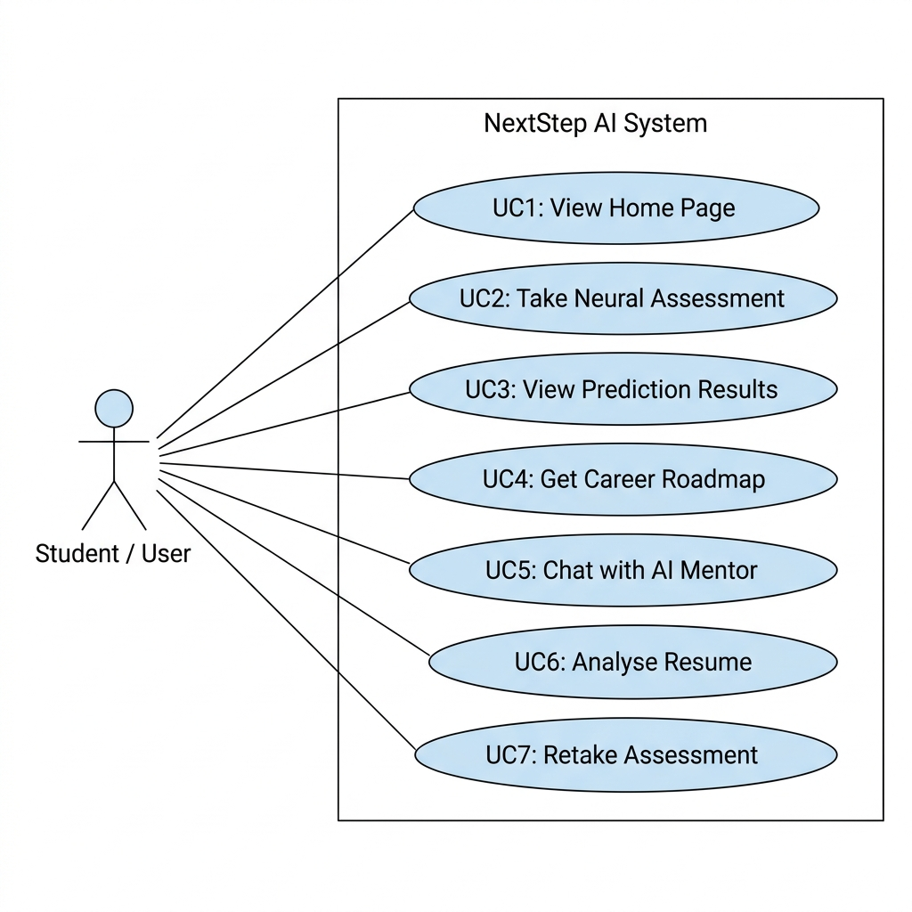
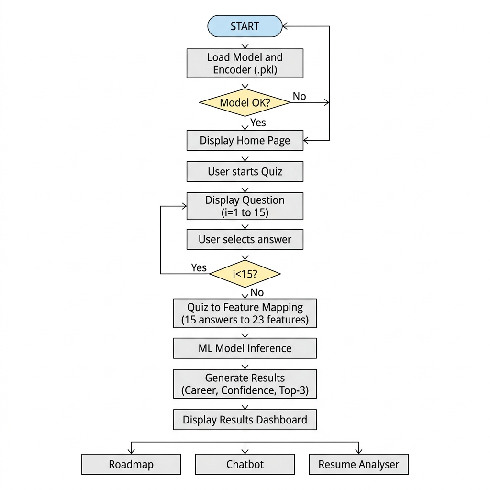
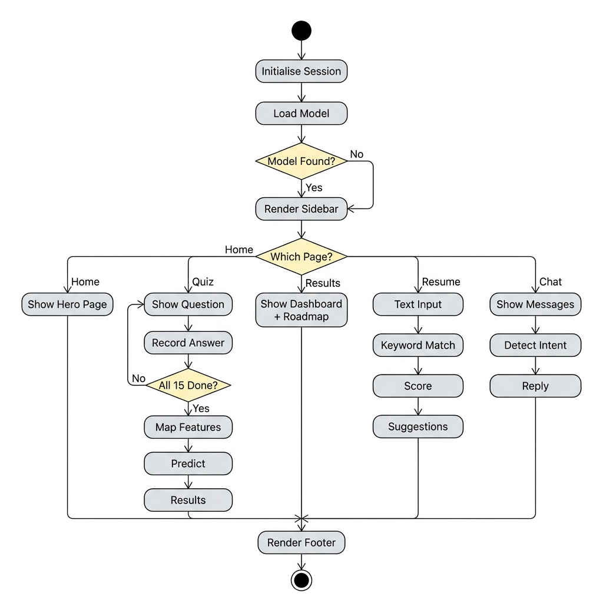
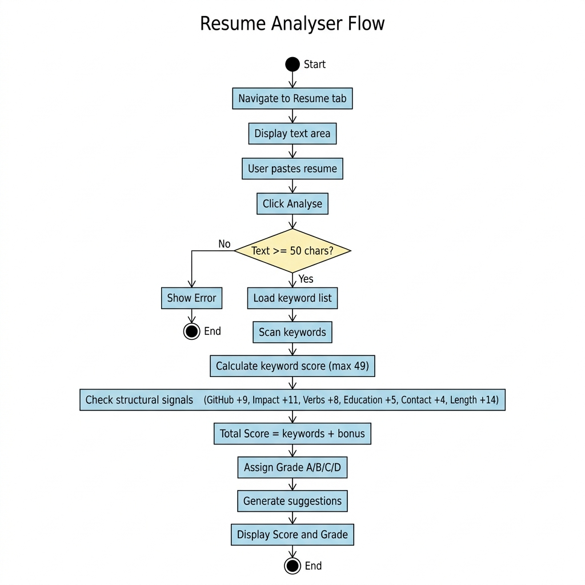
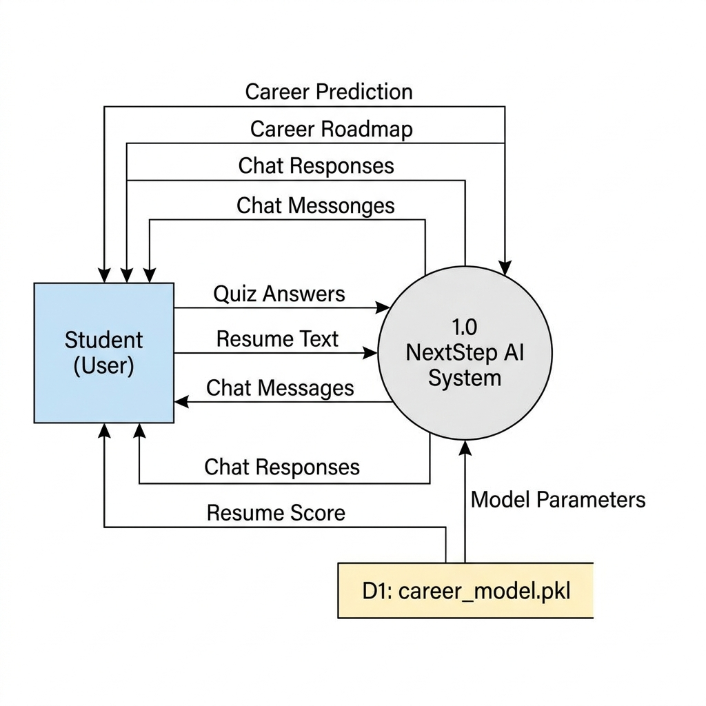
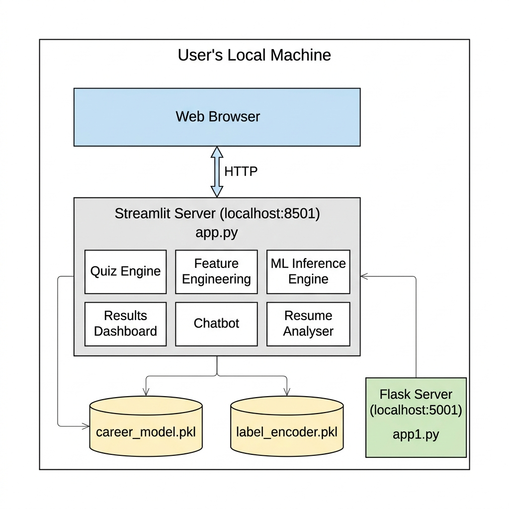

# Project Analysis and Design

## NextStep AI — Intelligent Career Prediction System

**Author:** Sneha Chandel | **Version:** 4.0 | **Date:** 2026-05-08

---

## 1. Hardware and Software Requirement Specifications

### 1.1 Hardware Requirements

| Component | Minimum Specification | Recommended Specification |
|---|---|---|
| **Processor** | Intel Core i3 / AMD Ryzen 3 (Dual Core, 2.0 GHz) | Intel Core i5 / AMD Ryzen 5 (Quad Core, 3.0 GHz+) |
| **RAM** | 4 GB DDR4 | 8 GB DDR4 or higher |
| **Storage** | 2 GB free disk space (application + model) | 5 GB free disk space (includes datasets for retraining) |
| **Display** | 1366 × 768 resolution | 1920 × 1080 Full HD |
| **Network** | Not required for inference (offline-capable) | Broadband for initial dependency installation |
| **Input Devices** | Standard keyboard and mouse | — |
| **GPU** | Not required (CPU-only inference) | Optional: for faster model retraining |

### 1.2 Software Requirements

| Category | Software | Version | Purpose |
|---|---|---|---|
| **Operating System** | Windows 10/11, Linux (Ubuntu 20.04+), macOS 12+ | — | Host environment |
| **Runtime** | Python | 3.9 – 3.12 | Core programming language |
| **Web Framework** | Streamlit | 1.55.0 | Primary interactive UI |
| **Alt. Web Framework** | Flask | 3.x | Lightweight REST API frontend |
| **ML Libraries** | scikit-learn | 1.7.2 | Model training and inference |
| | LightGBM | Latest | Gradient boosting classifier |
| | SHAP | Latest | Feature importance (Explainable AI) |
| | Optuna | Latest | Bayesian hyperparameter optimisation |
| **Data Libraries** | Pandas | 2.3.3 | Data manipulation |
| | NumPy | 2.4.3 | Numerical computation |
| **Balancing** | imbalanced-learn (SMOTE) | Latest | Oversampling minority classes |
| **Visualisation** | Matplotlib, Seaborn | Latest | Charts and plots |
| **Serialisation** | Python pickle | Built-in | Model persistence |
| **Package Manager** | pip | Latest | Dependency management |
| **Version Control** | Git | 2.x+ | Source code management |
| **IDE (Development)** | VS Code / Jupyter Notebook | Latest | Code editing and experimentation |
| **Browser** | Chrome / Firefox / Edge | Latest | Accessing the Streamlit UI |

### 1.3 Python Dependencies Summary

Key packages from `requirements.txt`:

```
streamlit==1.55.0    # Web UI framework
scikit-learn==1.7.2  # ML model training & inference
pandas==2.3.3        # Data processing
numpy==2.4.3         # Numerical operations
matplotlib==3.10.8   # Plotting
seaborn==0.13.2      # Statistical visualisation
```

---

## 2. Use Case Diagrams, Flowcharts, and Activity Diagrams

### 2.1 Use Case Diagram



```
┌─────────────────────────────────────────────────────────────────┐
│                        NextStep AI System                       │
│                                                                 │
│  ┌──────────────────┐    ┌──────────────────────────────────┐   │
│  │  UC1: View Home  │    │  UC2: Take Neural Assessment     │   │
│  │  Page            │    │  (15-Question Behavioural Quiz)  │   │
│  └──────────────────┘    └──────────────────────────────────┘   │
│                                                                 │
│  ┌──────────────────┐    ┌──────────────────────────────────┐   │
│  │  UC3: View AI    │    │  UC4: Get Career Roadmap         │   │
│  │  Prediction      │    │  (5-Phase Learning Path)         │   │
│  │  Results         │    │                                  │   │
│  └──────────────────┘    └──────────────────────────────────┘   │
│                                                                 │
│  ┌──────────────────┐    ┌──────────────────────────────────┐   │
│  │  UC5: Chat with  │    │  UC6: Analyse Resume             │   │
│  │  AI Mentor       │    │  (Keyword Scoring)               │   │
│  └──────────────────┘    └──────────────────────────────────┘   │
│                                                                 │
│  ┌──────────────────┐                                           │
│  │  UC7: Retake     │                                           │
│  │  Assessment      │                                           │
│  └──────────────────┘                                           │
└─────────────────────────────────────────────────────────────────┘
          ▲
          │ interacts
     ┌────┴────┐
     │  Actor: │
     │  Student│
     │  / User │
     └─────────┘
```

**Use Case Descriptions:**

| ID | Use Case | Actor | Description |
|---|---|---|---|
| UC1 | View Home Page | Student | User views the landing page with feature overview and starts the assessment. |
| UC2 | Take Neural Assessment | Student | User answers 15 behavioural MCQs one at a time with navigation support. |
| UC3 | View AI Prediction Results | Student | System displays predicted career, confidence score, personality tags, and top-3 matches. |
| UC4 | Get Career Roadmap | Student | System generates a 5-phase career learning path specific to the predicted career. |
| UC5 | Chat with AI Mentor | Student | User interacts with a rule-based chatbot for career-specific guidance. |
| UC6 | Analyse Resume | Student | User pastes resume text; system scores it (0–100) with keyword matching and suggestions. |
| UC7 | Retake Assessment | Student | User resets all quiz data and starts a fresh assessment. |

### 2.2 System Flowchart



```
                        ┌─────────────┐
                        │    START    │
                        └──────┬──────┘
                               │
                        ┌──────▼──────┐
                        │  Load Model │
                        │  & Encoder  │
                        │  (.pkl)     │
                        └──────┬──────┘
                               │
                    ┌──────────▼──────────┐
                    │  Model loaded OK?   │
                    └──────┬─────────┬────┘
                      Yes  │         │ No
                           │    ┌────▼─────┐
                           │    │ Demo Mode│
                           │    └────┬─────┘
                           │         │
                    ┌──────▼─────────▼────┐
                    │   Display Home Page  │
                    │   (Hero + Features)  │
                    └──────────┬───────────┘
                               │
                    ┌──────────▼───────────┐
                    │ User clicks "Start   │
                    │ Neural Assessment"   │
                    └──────────┬───────────┘
                               │
                    ┌──────────▼───────────┐
                    │  Display Question i  │◄──────┐
                    │  (i = 1 to 15)       │       │
                    └──────────┬───────────┘       │
                               │                   │
                    ┌──────────▼───────────┐       │
                    │  User selects answer │       │
                    │  Store answer[i]     │       │
                    └──────────┬───────────┘       │
                               │                   │
                    ┌──────────▼───────────┐       │
                    │   i < 15?            ├── Yes─┘
                    └──────────┬───────────┘
                          No   │
                    ┌──────────▼───────────┐
                    │  Quiz-to-Feature     │
                    │  Vector Mapping      │
                    │  (15 answers → 23    │
                    │   numeric features)  │
                    └──────────┬───────────┘
                               │
                    ┌──────────▼───────────┐
                    │  ML Model Inference  │
                    │  predict() +         │
                    │  predict_proba()     │
                    └──────────┬───────────┘
                               │
                    ┌──────────▼───────────┐
                    │  Generate Results:   │
                    │  • Top Career + Icon │
                    │  • Confidence Score  │
                    │  • Top-3 Ranking     │
                    │  • Personality Tags  │
                    │  • Explanation Text  │
                    └──────────┬───────────┘
                               │
                    ┌──────────▼───────────┐
                    │  Display Results     │
                    │  Dashboard           │
                    └──────────┬───────────┘
                               │
              ┌────────────────┼────────────────┐
              │                │                │
     ┌────────▼──────┐ ┌──────▼──────┐ ┌───────▼───────┐
     │ View Roadmap  │ │ AI Mentor   │ │ Resume        │
     │ (5 Phases)    │ │ Chatbot     │ │ Analyser      │
     └───────────────┘ └─────────────┘ └───────────────┘
```

### 2.3 Activity Diagram — Quiz & Prediction Flow



```
┌──────────────────────────────────────────────────────────────┐
│                    ACTIVITY DIAGRAM                          │
├──────────────────────────────────────────────────────────────┤
│                                                              │
│  (●) Start                                                   │
│   │                                                          │
│   ▼                                                          │
│  [Initialise Session State]                                  │
│   │                                                          │
│   ▼                                                          │
│  [Load career_model.pkl & label_encoder.pkl]                 │
│   │                                                          │
│   ├── <Model Found?> ── No ──► [Set Demo Mode Flag]         │
│   │         │                        │                       │
│   │        Yes                       │                       │
│   │         │                        │                       │
│   ▼         ▼                        ▼                       │
│  [Render Sidebar Navigation]                                 │
│   │                                                          │
│   ▼                                                          │
│  <Which Page?>                                               │
│   │         │          │          │          │                │
│  Home     Quiz     Results     Resume     Chat               │
│   │         │          │          │          │                │
│   ▼         ▼          ▼          ▼          ▼                │
│  [Show    [Show      [Show      [Show      [Show             │
│  Hero]   Question]  Prediction] Score]    Messages]          │
│   │         │          │          │          │                │
│   │         ▼          │          ▼          ▼                │
│   │   [Record Answer]  │   [Keyword Match] [Detect Intent]   │
│   │         │          │   [Calc Score]    [Lookup KB]        │
│   │         ▼          │   [Suggestions]   [Reply]           │
│   │   <All 15 Done?>   │          │          │                │
│   │    │         │     │          │          │                │
│   │   No        Yes    │          │          │                │
│   │    │         │     │          │          │                │
│   │    │    [Map to    │          │          │                │
│   │    │    Features]  │          │          │                │
│   │    │         │     │          │          │                │
│   │    │    [Predict]  │          │          │                │
│   │    │         │     │          │          │                │
│   │    └──►[Next Q]    │          │          │                │
│   │                    │          │          │                │
│   ▼                    ▼          ▼          ▼                │
│  ──────────────── [Render Footer] ───────────────            │
│                        │                                     │
│                       (●) End                                │
└──────────────────────────────────────────────────────────────┘
```

### 2.4 Activity Diagram — Resume Analyser



```
(●) Start
 │
 ▼
[User navigates to Resume Analyser tab]
 │
 ▼
[Display text area + career context]
 │
 ▼
[User pastes resume text]
 │
 ▼
[User clicks "Analyse Resume"]
 │
 ▼
<Text length ≥ 50 chars?>
 │           │
 No         Yes
 │           │
 ▼           ▼
[Show      [Load career-specific keyword list]
 Error]     │
             ▼
            [Scan for matched & missing keywords]
             │
             ▼
            [Calculate keyword score (max 49)]
             │
             ▼
            [Check structural signals:]
            [  GitHub link (+9)]
            [  Quantified impact (+11)]
            [  Action verbs (+8)]
            [  Education (+5)]
            [  Contact info (+4)]
            [  Optimal length (+14)]
             │
             ▼
            [Total Score = keyword_score + bonus]
            [Grade: A(≥80) B(≥60) C(≥40) D(<40)]
             │
             ▼
            [Generate improvement suggestions]
             │
             ▼
            [Display: Score, Grade, Keywords, Tips]
             │
             ▼
            (●) End
```

### 2.5 Data Flow Diagram (Level 0 — Context)



```
┌──────────┐    Quiz Answers     ┌─────────────────────┐    Prediction
│          │ ──────────────────► │                     │ ──────────────►
│  Student │    Resume Text      │    NextStep AI      │    Roadmap
│  (User)  │ ──────────────────► │    System           │ ──────────────►
│          │    Chat Messages    │                     │    Chat Reply
│          │ ──────────────────► │                     │ ──────────────►
│          │                     │                     │    Resume Score
│          │ ◄────────────────── │                     │ ──────────────►
└──────────┘   UI Responses      └─────────────────────┘
                                         ▲
                                         │
                                  ┌──────┴──────┐
                                  │ career_     │
                                  │ model.pkl   │
                                  │ (ML Model)  │
                                  └─────────────┘
```

---

## 3. Connection Diagram / System Architecture

> **Note:** NextStep AI is a **software-only project** and does not involve hardware circuits or physical connections. This section presents the **system architecture and component interaction diagram** as the equivalent of a connection diagram.

### 3.1 System Architecture Diagram



```
┌─────────────────────────────────────────────────────────────────────┐
│                         USER'S LOCAL MACHINE                        │
│                                                                     │
│  ┌──────────────┐         ┌──────────────────────────────────────┐  │
│  │   Web        │  HTTP   │         Streamlit Server             │  │
│  │   Browser    │◄───────►│         (localhost:8501)             │  │
│  │              │         │                                      │  │
│  │  • Chrome    │         │  ┌────────────────────────────────┐  │  │
│  │  • Firefox   │         │  │          app.py                │  │  │
│  │  • Edge      │         │  │                                │  │  │
│  └──────────────┘         │  │  ┌──────────┐ ┌─────────────┐ │  │  │
│                           │  │  │ Quiz     │ │ Results     │ │  │  │
│                           │  │  │ Engine   │ │ Dashboard   │ │  │  │
│                           │  │  └────┬─────┘ └──────▲──────┘ │  │  │
│                           │  │       │              │        │  │  │
│                           │  │  ┌────▼──────────────┴─────┐  │  │  │
│                           │  │  │  Feature Engineering    │  │  │  │
│                           │  │  │  (quiz_to_features)     │  │  │  │
│                           │  │  └────────────┬────────────┘  │  │  │
│                           │  │               │               │  │  │
│                           │  │  ┌────────────▼────────────┐  │  │  │
│                           │  │  │  ML Inference Engine    │  │  │  │
│                           │  │  │  predict() /            │  │  │  │
│                           │  │  │  predict_proba()        │  │  │  │
│                           │  │  └────────────┬────────────┘  │  │  │
│                           │  │               │               │  │  │
│                           │  │  ┌────────────▼────────────┐  │  │  │
│                           │  │  │  career_model.pkl       │  │  │  │
│                           │  │  │  label_encoder.pkl      │  │  │  │
│                           │  │  └─────────────────────────┘  │  │  │
│                           │  │                                │  │  │
│                           │  │  ┌───────────┐ ┌───────────┐  │  │  │
│                           │  │  │ Chatbot   │ │ Resume    │  │  │  │
│                           │  │  │ (KB +     │ │ Analyser  │  │  │  │
│                           │  │  │  Intent)  │ │ (Regex)   │  │  │  │
│                           │  │  └───────────┘ └───────────┘  │  │  │
│                           │  └────────────────────────────────┘  │  │
│                           └──────────────────────────────────────┘  │
│                                                                     │
│  ┌──────────────────────────────────────────────────────────────┐   │
│  │  Alternative: Flask Server (localhost:5001)                  │   │
│  │  app1.py ──► templates/index.html ──► /predict API          │   │
│  └──────────────────────────────────────────────────────────────┘   │
└─────────────────────────────────────────────────────────────────────┘
```

### 3.2 Component Interaction Flow

```
Browser ──► Streamlit Server ──► Session State Manager
                │                        │
                ├── inject_css()         │
                ├── render_sidebar()     │
                │                        │
                ├── page_home()          │
                ├── page_quiz() ────────►│──► quiz_to_features()
                │                        │         │
                │                        │    predict() ◄── career_model.pkl
                │                        │         │
                ├── page_results() ◄─────│─────────┘
                │       │                │
                │       ├── render_roadmap() ◄── ROADMAPS dict
                │       └── infer_personality()
                │                        │
                ├── page_chat() ─────────│──► chatbot_response()
                │                        │       │
                │                        │       ◄── CHATBOT_KB dict
                │                        │
                └── page_resume() ───────│──► analyze_resume()
                                         │       │
                                         │       ◄── RESUME_KEYWORDS dict
                                         │
                                    [st.session_state]
```

---

## 4. Description of Components Used

> **Note:** As a software project, this section describes the **software components and modules** rather than physical hardware components.

### 4.1 Core Application Components

| Component | File | Description |
|---|---|---|
| **Main Application** | `app.py` (1,630 lines) | Monolithic Streamlit app containing all UI pages, CSS, quiz logic, ML inference, chatbot, and resume analyser. |
| **Flask API** | `app1.py` (88 lines) | Lightweight REST API alternative that serves an HTML form and exposes a `/predict` endpoint. |
| **HTML Frontend** | `templates/index.html` | Glassmorphic dark-themed form UI for the Flask frontend with 22 input fields. |

### 4.2 ML Pipeline Components

| Component | File(s) | Description |
|---|---|---|
| **Training Notebook** | `model.ipynb` | Jupyter notebook for data loading, cleaning, feature engineering, label assignment, model training (RandomForest), and pickle serialisation. |
| **LightGBM + Optuna Trainer** | `train_lgbm_optuna.py` | SHAP-based feature selection → Optuna hyperparameter tuning (40 trials) → LightGBM final model with full metric reporting. |
| **Decision Tree Trainer** | `train_decision_tree.py` | Baseline Decision Tree training script. |
| **10-Model Benchmark** | `generate_comparative_analysis.py` | Comprehensive script that trains and evaluates 10 model configurations (DT/LGBM × baseline/tuned × all/SHAP/MI/Boruta features). |
| **Individual Model Scripts** | `model_1_*.py` through `model_10_*.py` | Standalone scripts for each of the 10 benchmark models. |
| **Comparison Plotter** | `plot_comparison.py` | Generates bar chart visualisations comparing model performance. |

### 4.3 Serialised Model Artifacts

| Artifact | Size | Description |
|---|---|---|
| `career_model.pkl` | 2.3 MB | Trained classifier (RandomForest/LightGBM) serialised via Python pickle. Loaded at startup with `@st.cache_resource`. |
| `label_encoder.pkl` | 334 B | scikit-learn LabelEncoder mapping integer class IDs to career name strings. |
| `features.pkl` | 369 B | Stored list of feature column names for model input alignment. |

### 4.4 Dataset Components

| Dataset | Size | Records | Description |
|---|---|---|---|
| `student_data.csv` | 42 KB | ~400 | UCI Student Performance dataset — academic grades, study time, failures, absences, internet access. |
| `data-final.csv` | 416 MB | Large | Big Five personality traits (openness, conscientiousness, extraversion, agreeableness, neuroticism). |
| `skills.csv` | 1 MB | Variable | Coding, communication, and analytical skill ratings. |
| `Student Attitude and Behavior.csv` | 29 KB | Variable | Study hours, consistency, and participation metrics. |
| `final_career_dataset.csv` | 187 KB | 1,000 | Merged and labelled training dataset with 22 features + 1 target (career). |

### 4.5 Key Algorithm Components

#### 4.5.1 Feature Engineering Pipeline (`quiz_to_features`)

Transforms 15 quiz answers into a 23-dimensional feature vector:

- **Latent Signal Extraction**: Computes `tech_lat`, `art_lat`, `biz_lat`, `res_lat` scores (0–1) from 5 domain-indicator questions.
- **Academic Mapping**: Derives grades, study time, failures, and absences from performance and behaviour questions.
- **Big Five Personality**: Computes openness, conscientiousness, extraversion, agreeableness, neuroticism from composite answer signals.
- **Skill Scoring**: Maps coding, communication, and analytical skills from latent signals and individual answers.
- **Dominant-Intent Calibration**: Boosts the strongest domain signal above model decision thresholds.
- **One-Hot Encoding**: Converts `internet_access` to binary columns matching model training format.

#### 4.5.2 Prediction Engine (`predict`)

- Calls `model.predict()` for the top career label.
- Calls `model.predict_proba()` for probability distribution across all classes.
- Ranks top-3 careers by probability.
- Decodes integer labels to career strings via `label_encoder.inverse_transform()`.
- Falls back to a hardcoded mapping if label encoder is unavailable.

#### 4.5.3 Chatbot Engine (`chatbot_response`)

- **Intent Detection**: Keyword matching against 10 intent categories.
- **Knowledge Base Lookup**: Career-specific responses (9 careers × 5 topics) + general responses (5 topics).
- **Fallback**: Generic prompt listing available topics if no intent is matched.

#### 4.5.4 Resume Scoring Engine (`analyze_resume`)

- **Keyword Matching**: Career-specific keyword lists (9 careers + default).
- **Structural Analysis**: Regex-based detection of GitHub links, quantified achievements, action verbs, education, and contact information.
- **Scoring Formula**: `score = keyword_score (max 49) + structural_bonus (max 51)`.
- **Grading**: A (≥80), B (≥60), C (≥40), D (<40).

### 4.6 UI/CSS Design System Component

The application uses a custom CSS design system (`inject_css()`) featuring:

| Element | Technology |
|---|---|
| **Typography** | Google Fonts — Space Grotesk, Inter, Fira Code |
| **Theme** | Dark neon glassmorphism with animated gradient background |
| **Cards** | `backdrop-filter: blur(16px)` with 3D hover transforms |
| **Animations** | `@keyframes` for floating hero, pulsing dots, fade-up entries, slow background pan |
| **Colour System** | 11 CSS custom properties (design tokens) for consistent theming |
| **Responsive** | `clamp()` font sizing, flexible grid layouts |

---

## 5. Summary

NextStep AI is a fully self-contained, privacy-first career prediction system that requires no cloud infrastructure or API keys. The system architecture follows a simple client-server model where both the Streamlit server and the user's browser run on the same local machine. The ML pipeline supports extensive experimentation through 10 benchmarked model configurations with multiple feature selection strategies and hyperparameter optimisation. All components are implemented in Python with a single-file application architecture for ease of deployment.
