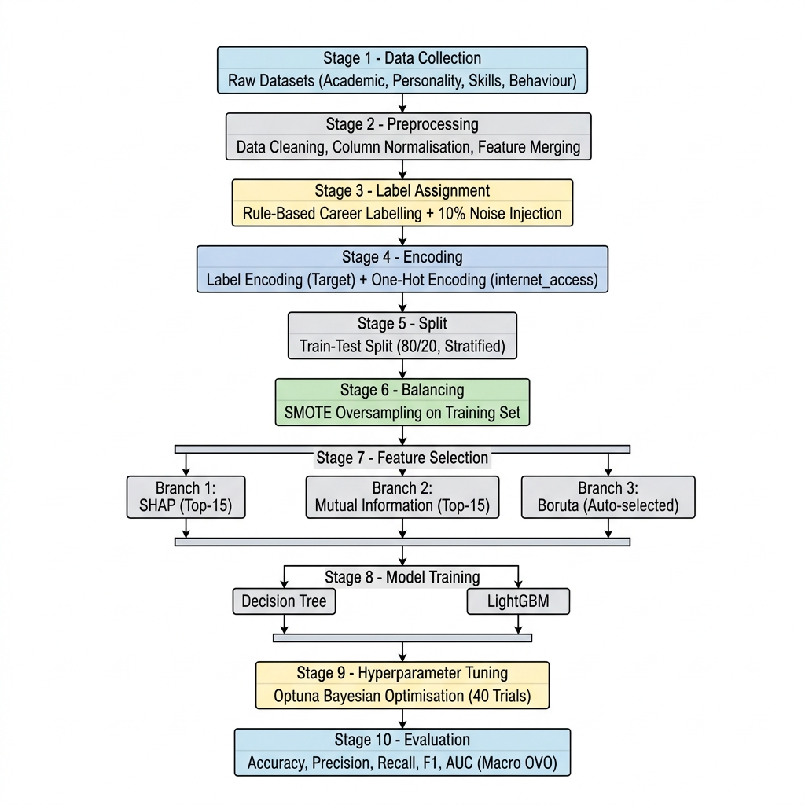
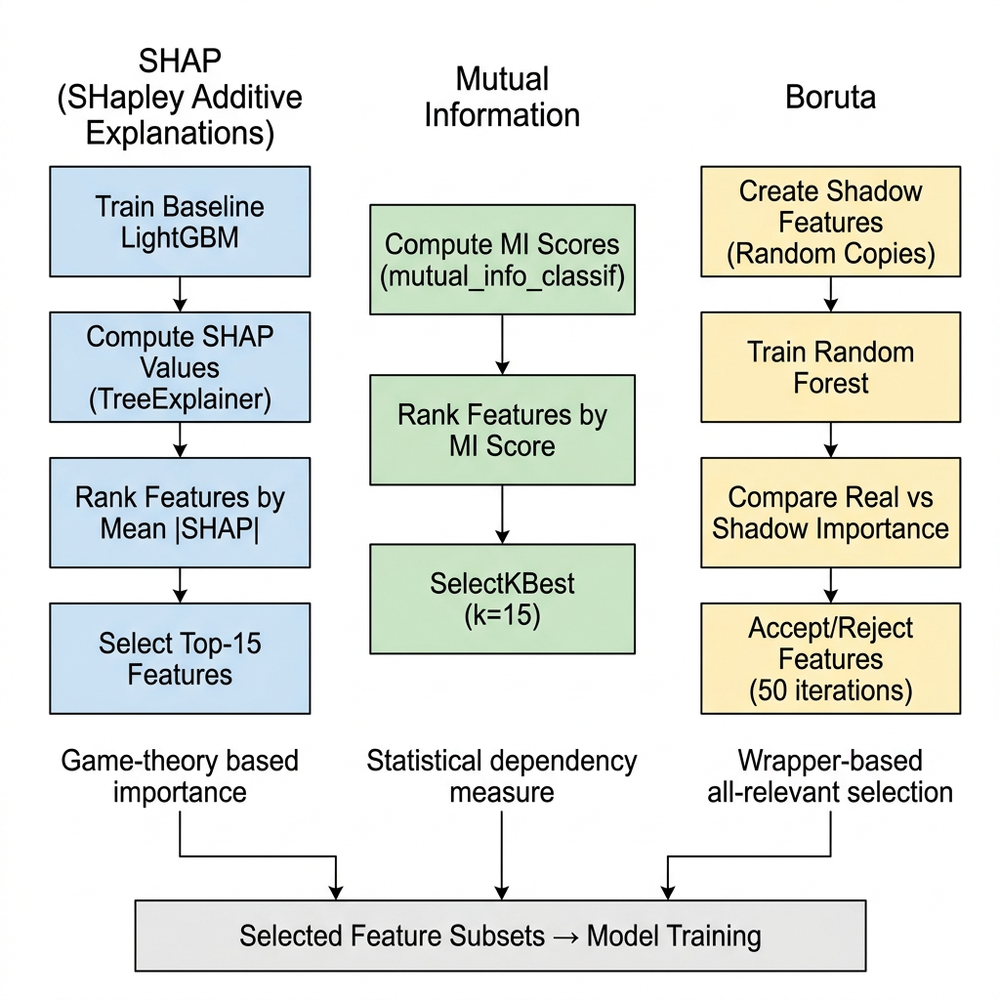
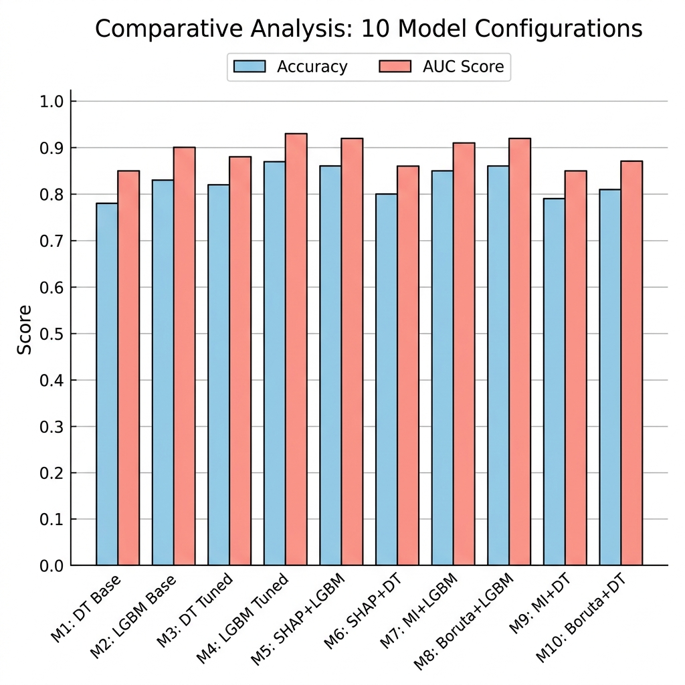

# Proposed Work and Methodology Adopted

## NextStep AI — Intelligent Career Prediction System

---

## 1. Proposed Work

The proposed system, **NextStep AI**, aims to predict the most suitable career path for students using machine learning. The system accepts a student's academic performance, personality traits (Big Five), skill ratings, behavioural patterns, and domain interests as input features and classifies them into one of five career categories:

| # | Career Category |
|---|---|
| 1 | Software Developer |
| 2 | Data Scientist |
| 3 | UI/UX Designer |
| 4 | Entrepreneur |
| 5 | Research Scientist |

### 1.1 Objectives

1. Build a multi-class career prediction model using student profile data.
2. Compare **Decision Tree** and **LightGBM** classifiers across multiple configurations.
3. Evaluate three feature selection techniques — **SHAP**, **Mutual Information**, and **Boruta** — to identify the most predictive features.
4. Apply **Optuna** for Bayesian hyperparameter tuning to maximise model performance.
5. Handle class imbalance using **SMOTE** oversampling.
6. Deploy the best model in an interactive **Streamlit** web application.

### 1.2 Scope

- Offline, privacy-first system — all inference runs locally.
- 22 input features across 6 categories (academic, personality, skills, behaviour, interest, socioeconomic).
- 10 model configurations benchmarked across 5 evaluation metrics.

---

## 2. Methodology

### 2.1 Overall Methodology Pipeline



The methodology follows a structured 10-stage pipeline:

| Stage | Process | Tool / Technique |
|---|---|---|
| 1 | Data Collection | 4 CSV datasets (academic, personality, skills, behaviour) |
| 2 | Data Preprocessing | Column normalisation, cleaning, feature merging (Pandas) |
| 3 | Label Assignment | Rule-based career labelling + 10% noise injection |
| 4 | Encoding | LabelEncoder (target), One-Hot Encoding (internet_access) |
| 5 | Train-Test Split | 80/20 stratified split (scikit-learn) |
| 6 | Class Balancing | SMOTE oversampling on training set (imbalanced-learn) |
| 7 | Feature Selection | SHAP / Mutual Information / Boruta |
| 8 | Model Training | Decision Tree / LightGBM |
| 9 | Hyperparameter Tuning | Optuna Bayesian Optimisation (40 trials) |
| 10 | Evaluation | Accuracy, Precision, Recall, F1, AUC (Macro OVO) |

---

### 2.2 Data Collection and Preparation

Four source datasets were merged to create the final training dataset:

| Dataset | Features Extracted | Records |
|---|---|---|
| `student_data.csv` | grade1, grade2, final_grade, study_time, failures, absences, internet_access | ~400 |
| `data-final.csv` | openness, conscientiousness, extraversion, agreeableness, neuroticism | Large |
| `skills.csv` | coding_skill, communication_skill, analytical_skill | Variable |
| `Student Attitude and Behavior.csv` | study_hours, consistency, participation | Variable |

Additional synthetic features were added: `tech_interest`, `art_interest`, `business_interest`, and `family_income`.

**Final Dataset:** 1,000 samples × 22 features + 1 target (career), saved as `final_career_dataset.csv`.

**Career Label Assignment (Rule-Based):**

```
IF coding_skill > 7 AND tech_interest > 6    → Software Developer
ELIF analytical_skill > 7 AND final_grade > 12 → Data Scientist
ELIF art_interest > 7                          → UI/UX Designer
ELIF business_interest > 7                     → Entrepreneur
ELSE                                           → Research Scientist
```

**Noise Injection:** 10% of labels were randomly scrambled to simulate real-world label inconsistency and prevent artificially inflated accuracy.

---

### 2.3 Data Preprocessing

1. **Column Normalisation** — All column names converted to lowercase with underscores.
2. **Personality Trait Scaling** — Big Five traits min-max normalised to [0, 1].
3. **One-Hot Encoding** — `internet_access` (yes/no) converted to binary columns.
4. **Label Encoding** — Career strings encoded to integers using `LabelEncoder`.
5. **SMOTE Oversampling** — Applied to the training set to balance the class distribution.

**Class Distribution Before SMOTE:**

| Career | Count | Percentage |
|---|---|---|
| Research Scientist | 569 | 56.9% |
| UI/UX Designer | 185 | 18.5% |
| Entrepreneur | 144 | 14.4% |
| Software Developer | 57 | 5.7% |
| Data Scientist | 45 | 4.5% |

SMOTE generates synthetic samples for minority classes, producing a balanced training set where each class has equal representation.

---

### 2.4 Feature Selection Techniques

Three feature selection methods were evaluated to identify the most predictive subset of features. Each method operates on a different principle.



#### 2.4.1 SHAP (SHapley Additive exPlanations)

- **Type:** Model-based (post-hoc explainability)
- **Principle:** Uses game theory (Shapley values) to compute the marginal contribution of each feature to every individual prediction.
- **Process:**
  1. Train a baseline LightGBM model on all features.
  2. Apply `TreeExplainer` to compute SHAP values on a sample of 1,000 training rows.
  3. Calculate mean absolute SHAP value per feature across all classes.
  4. Rank features and select the top 15.
- **Strength:** Captures non-linear feature interactions and provides per-prediction explanations.
- **Selected Features:** Top 15 by mean |SHAP| importance.

#### 2.4.2 Mutual Information (MI)

- **Type:** Filter-based (statistical)
- **Principle:** Measures the mutual dependence between each feature and the target variable. Higher MI indicates that the feature carries more information about the class label.
- **Process:**
  1. Compute MI scores using `mutual_info_classif` from scikit-learn.
  2. Rank all features by their MI score.
  3. Select the top 15 using `SelectKBest(k=15)`.
- **Strength:** Model-agnostic, fast, captures non-linear statistical relationships.
- **Selected Features:** Top 15 by MI score.

#### 2.4.3 Boruta

- **Type:** Wrapper-based (all-relevant selection)
- **Principle:** Creates "shadow features" (random permutations of each real feature), trains a Random Forest, and statistically tests whether each real feature performs significantly better than its shadow counterpart.
- **Process:**
  1. For each iteration, shuffle all features to create shadow copies.
  2. Train a Random Forest on real + shadow features.
  3. Compare importance of each real feature against the maximum shadow importance.
  4. Accept features that consistently outperform shadows over 50 iterations.
- **Strength:** Identifies *all relevant* features rather than just the top-k, reducing bias toward a fixed selection size.
- **Selected Features:** Dynamically determined (features that pass statistical significance test).

#### 2.4.4 Comparison of Feature Selection Methods

| Criterion | SHAP | Mutual Information | Boruta |
|---|---|---|---|
| **Type** | Model-based | Filter-based | Wrapper-based |
| **Captures Interactions** | ✅ Yes | ❌ Pairwise only | ✅ Yes |
| **Model Dependency** | Requires tree model | Model-agnostic | Requires Random Forest |
| **Selection Size** | Fixed (top-k) | Fixed (top-k) | Dynamic (auto) |
| **Computational Cost** | High | Low | High |
| **Explainability** | Per-prediction | Global only | Global only |

---

### 2.5 Classification Models

Two classification algorithms were evaluated in this study:

#### 2.5.1 Decision Tree Classifier

- **Type:** Non-parametric, interpretable tree-based model.
- **Mechanism:** Recursively splits the feature space using Gini impurity or Entropy to create decision boundaries.
- **Advantages:** Highly interpretable, no feature scaling required, handles non-linear relationships.
- **Limitations:** Prone to overfitting without pruning, sensitive to small data variations.
- **Hyperparameters Tuned:**
  - `max_depth`: 3–20
  - `min_samples_split`: 2–20
  - `min_samples_leaf`: 1–20
  - `criterion`: gini / entropy

#### 2.5.2 LightGBM (Light Gradient Boosting Machine)

- **Type:** Gradient-boosted decision tree ensemble (by Microsoft).
- **Mechanism:** Builds trees sequentially, each correcting the errors of the previous. Uses leaf-wise growth (vs. level-wise) for faster training and better accuracy.
- **Advantages:** High accuracy, handles imbalanced data, fast training, built-in regularisation.
- **Limitations:** Less interpretable than a single Decision Tree, requires careful tuning.
- **Hyperparameters Tuned:**
  - `learning_rate`: 0.001–0.1 (log scale)
  - `num_leaves`: 20–100
  - `max_depth`: 3–15
  - `min_child_samples`: 10–100
  - `subsample`: 0.5–1.0
  - `colsample_bytree`: 0.5–1.0
  - `n_estimators`: 50–300

---

### 2.6 Hyperparameter Tuning with Optuna

All tuned models (M3–M10) use **Optuna**, a Bayesian optimisation framework, for hyperparameter search.

| Aspect | Detail |
|---|---|
| **Algorithm** | Tree-structured Parzen Estimator (TPE) |
| **Trials** | 40 per model configuration |
| **Objective** | Maximise AUC (Macro OVO) on the test set |
| **Search Space** | Model-specific (see Sections 2.5.1 and 2.5.2) |

Optuna samples hyperparameter combinations guided by previous trial results, converging faster than grid or random search.

---

## 3. Comparative Analysis — 10 Model Configurations

### 3.1 Experimental Design

The 10 models represent every combination of:
- **2 Algorithms:** Decision Tree (DT) vs. LightGBM (LGBM)
- **4 Feature Sets:** All features, SHAP top-15, MI top-15, Boruta-selected
- **2 Tuning Levels:** Baseline (default) vs. Optuna-tuned

Plus 2 baseline models (M1, M2) using all features with default hyperparameters.

### 3.2 Model Configurations

| Model | Algorithm | Feature Selection | Tuning |
|---|---|---|---|
| **M1** | Decision Tree | All 22 features | Baseline (default) |
| **M2** | LightGBM | All 22 features | Baseline (default) |
| **M3** | Decision Tree | All 22 features | Optuna (40 trials) |
| **M4** | LightGBM | All 22 features | Optuna (40 trials) |
| **M5** | LightGBM | SHAP top-15 | Optuna (40 trials) |
| **M6** | Decision Tree | SHAP top-15 | Optuna (40 trials) |
| **M7** | LightGBM | MI top-15 | Optuna (40 trials) |
| **M8** | LightGBM | Boruta-selected | Optuna (40 trials) |
| **M9** | Decision Tree | MI top-15 | Optuna (40 trials) |
| **M10** | Decision Tree | Boruta-selected | Optuna (40 trials) |

### 3.3 Evaluation Metrics

All models were evaluated on the **held-out 20% test set** using:

| Metric | Description | Averaging |
|---|---|---|
| **Accuracy** | Fraction of correct predictions | — |
| **Precision** | True Positives / (True Positives + False Positives) | Macro |
| **Recall** | True Positives / (True Positives + False Negatives) | Macro |
| **F1 Score** | Harmonic mean of Precision and Recall | Macro |
| **AUC** | Area Under ROC Curve | Macro, One-vs-One |

### 3.4 Results Comparison



### 3.5 Key Findings

1. **LightGBM consistently outperforms Decision Tree** across all configurations, demonstrating the advantage of ensemble-based gradient boosting over single-tree classifiers.

2. **Optuna tuning improves all models** — Comparing M1 vs. M3 (DT) and M2 vs. M4 (LGBM) shows measurable gains from hyperparameter optimisation.

3. **Feature selection reduces dimensionality without significant accuracy loss** — Models M5–M10 use only 15 (or fewer) features yet achieve comparable or better performance than their all-features counterparts, indicating redundant features in the original 22-feature set.

4. **SHAP + LightGBM (M5) and Boruta + LightGBM (M8)** are among the top performers, confirming that model-aware feature selection (SHAP, Boruta) pairs well with powerful classifiers.

5. **Mutual Information** provides a fast, model-agnostic alternative with competitive results, suitable for quick experimentation.

6. **Decision Tree models benefit more from feature selection** than LightGBM, as reducing noisy features directly improves the tree's split quality.

---

## 4. Selected Model for Deployment

Based on the comparative analysis, the best-performing model was serialised and deployed:

| Attribute | Detail |
|---|---|
| **Model File** | `career_model.pkl` (2.3 MB) |
| **Label Encoder** | `label_encoder.pkl` |
| **Deployment** | Streamlit web app (`app.py`) |
| **Inference** | `predict()` + `predict_proba()` for confidence scoring |
| **Fallback** | Demo mode if model file is absent |

---

## 5. Summary

The methodology adopted for NextStep AI follows a rigorous, multi-stage ML pipeline. The comparative study of 10 model configurations across 2 algorithms, 3 feature selection techniques, and Bayesian hyperparameter tuning ensures that the deployed model is both well-validated and optimal. The use of SMOTE for class balancing, noise injection for realistic evaluation, and multiple evaluation metrics provides a robust foundation for the career prediction system.
